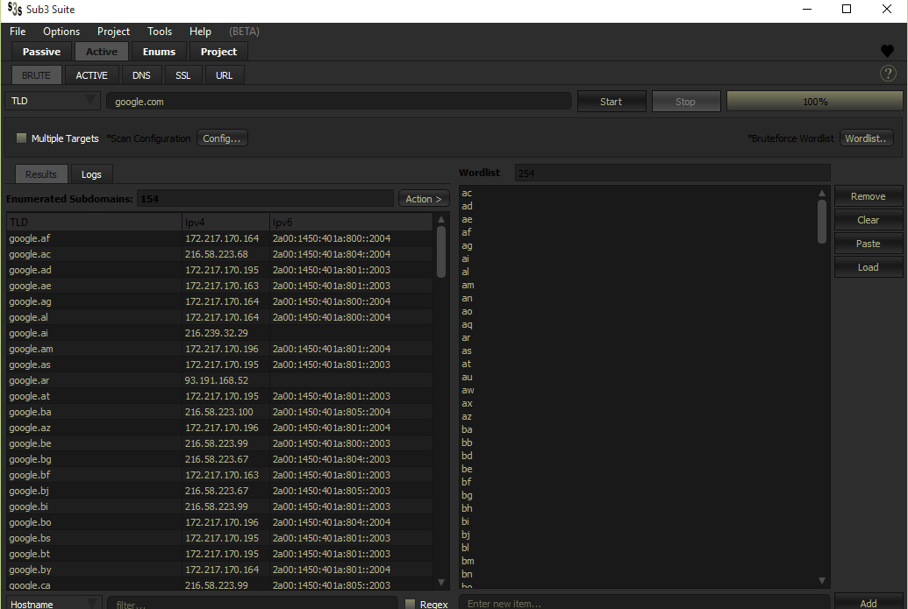

# Getting Started

This is a simple guide on how to get started with `subdomain enumeration`, `OSINT gathering` & `Target mapping`.

## Use Cases

These enumerations processes can be used for offensive & defensive cyber operations, Bug-Bounty hunting & Research. Multiple techniques are normally used by mulitple tools to attain this goal.
[sub3suite](https://github.com/3nock/sub3suite) combines these different techniques and provide you with multiple capability tools into one suite for effective enumeration both manually and automatic.

## General Concepts

- Passive Subdomain Enumeration.
- Active Subdomain Enumeration.
- OSINT (Open-source intelligence).
- OSINT Information gathering.
- Target Mapping.

## Subdomain Enumeration

Subdomain enumeration is the process of finding sub-domains for one or more domains. It helps to broader the attack surface, find hidden applications, and forgotten subdomains.

**why subdomain enumeration?**

 - Sub-domain enumeration helps to create a scope of security assessment by revealing domains/sub-domains of a target organization.
 - Sub-domain enumeration increases the chance of finding vulnerabilities.
 - The sub-domain enumeration helps us in finding the web applications that might be forgotten/left unattended by the organization for the maintenance or other reasons and may lead to the disclosure of critical vulnerabilities.

### Passive Subdomain Enumeration

For passive subdomain enumeration the subdomains are obtained from a third party without directly connecting to the target's infrastructures. These 3rd parties gather and store open information gathered from devices
connected to the internet and contain an interface to share this data e.g `API`. Passive sources include [VirusTotal](https://virustotal.com), [shodan](https://shodan.io), [host](https://host.io), [SecurityTrails](https://securitytrails.com/) etc.

- Multiple tools are available For this purpose. Open source tools like [theHarvester](https://github.com/laramies/theHarvester) & [amass](https://github.com/OWASP/Amass) are among the most popular in this filed.

- [sub3suite](https://github.com/3nock/sub3suite) has an OSINT tool that can be used for passive subdomain enumeration able to pull data from 50+ osint source in a matter of seconds & gives users the ability to manipulate this data to their liking.

Sub3suite's OSINT Tool.

### Active Subdomain Enumeration

In active subdomain enumeration, the adversary or tester gathers the information by directly probing the infrastructure managed by the organization. In active enumeration, the detection of adversary or tester may be possible by the organization. Such kind of probing may raise alerts and/or flags.

- Multiple tools are available For this purpose. Open source tools like [subbrute](https://github.com/TheRook/subbrute), [knock](https://github.com/guelfoweb/knock) & [fierce](https://github.com/mschwager/fierce) are among the most popular in this filed.

- [sub3suite](https://github.com/3nock/sub3suite) has `BRUTEFORCE`, `ACTIVE` & `DNS` tools that can be used for active subdomain enumeration using multiple techniques & features that are highly efficient and with a low barrier of entry to get started with active subdomain enumeration.

Sub3suite's BRUTE Tool.

### Open-source Intelligence (OSINT)

Open-source intelligence is the collection and analysis of data gathered from open sources to produce actionable intelligence.
There are many techniques and tools used in this field that i can't go in details but there are many great articles out there going into much details about this topic, please checkout the references for some of this articles.

- [OSINT Framework](https://osintframework.com/) provides a very good overview and guide to many defferent types of OSINT enumeration and tools to use.

- [sub3suite](https://github.com/3nock/sub3suite) has an multiple tools that can be used for OSINT information gathering of defferent data types such tools include `Enumerators` that enumerate specific data types such as
`IP`, `ASN`, `CIDR`, `NS(Nameservers)`, `MX(MailExchange)`, `SSL Certificates` & `Emails` to much greater details, You can check it out for yourself.

### Target Mapping

Target Mapping referes to the general process of mapping(gathering relevant information) on the attack surface of the Target. Both Passive(OSINT) & Active methods are used to accomplish this.
different data types are used for mapping the target such as domains, ip-addresses, asn, cidr, emails, phone, users, subdomains etc. There are many techniques used in this process and can most times be very much time consuming.

- Multiple tools are used to ease the information gathering and mapping process with the most popular ones being [maltego](https://maltego.com/) & [spiderfoot](https://spiderfoot.net).
- [sub3suite](https://github.com/3nock/sub3suite) also has the tools for this purpose though still in early development phase at this time but you can use multiple tools at its disposal to achieve this goal.

Sub3suite's Project map

### Summary

This is just a very very simple guide to help you get started. There are many other information & guides out there that are written in greater details on these topics that can help you best get started and master these topics. 
Anyways i hope this small overview has been of much help.

### References

These articles will be of much help in learning in greater details.

1. [https://lazyhacker.medium.com/subdomain-enumeration-tec-276da39d7e69](https://lazyhacker.medium.com/subdomain-enumeration-tec-276da39d7e69)
2. [https://0xffsec.com/handbook/information-gathering/subdomain-enumeration/](https://0xffsec.com/handbook/information-gathering/subdomain-enumeration/)
3. [https://blog.sweepatic.com/art-of-subdomain-enumeration/](https://blog.sweepatic.com/art-of-subdomain-enumeration/)
