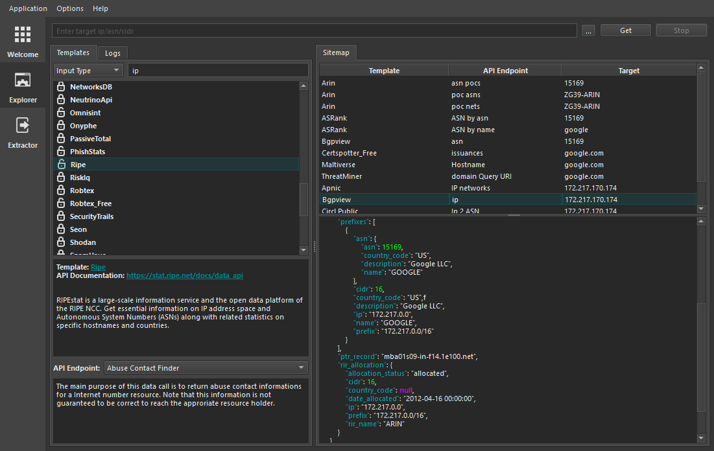
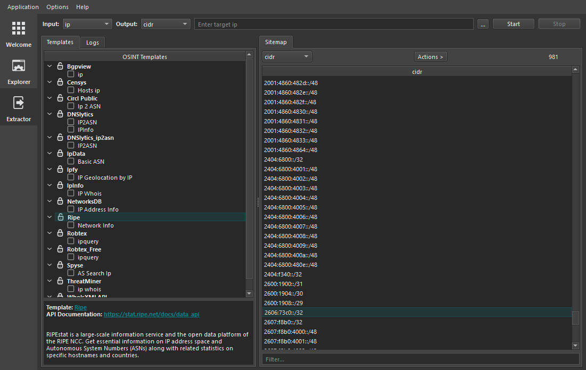

    

    
    
    

OSINT Template Engine is a research-grade tool for OSINT Information gathering & Attack Surface Mapping which uses customizable templates to collect data from respective sources. It allows for new template creation and modification of existing ones which gives it a competitive advantage over other tools of the same category. For more information see the [documentation](https://github.com/3nock/OTE/wiki)

# Installation and Usage

OSINT Template Engine is designed for easy installation and usage even for first timers.

- First, [download](https://github.com/3nock/OTE/releases) the package of your choice.

- Then [install](https://github.com/3nock/OTE/wiki/Installation) the downloaded SpiderSuite package.

For complete documentation of OSINT Template Engine see [wiki](https://github.com/3nock/OTE/wiki).

# Contributing 

_**Are you a developer?**_

You can check out open [issues](https://github.com/3nock/OTE/issues) and lookout for `TODOs` scattered all over the source code.

_**Not a developer?**_

You can help by reporting [bugs](https://github.com/3nock/OTE/issues), requesting new [features](https://github.com/3nock/OTE/issues), improving the [documentation](https://github.com/3nock/OTE/wiki), [sponsoring](SPONSOR.md) the project & writing articles.

For More information see [contribution guide](CONTRIBUTING.md).

# Credits

This project is greatly inspired by projectdiscovery's [nuclei](https://github.com/projectdiscovery/nuclei) vulnerability scanner.

It also includes software developed by the following open source projects:
- SQLite database [library](https://sqlite.org)
