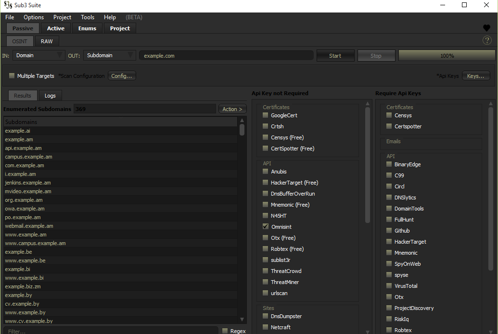
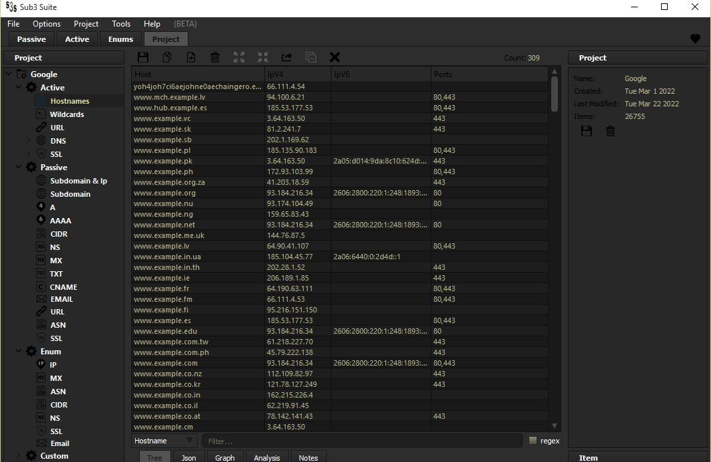

 

# Subdomain Enumeration Suite
Sub3 Suite is a research-grade suite of tools for Subdomain Enumeration, OSINT Information gathering & Attack Surface Mapping. Supports both
manual and automated analysis on variety of target types with many available features & tools. For more information checkout the [documentation](https://github.com/3nock/s3s_doc/blob/main/md/index.md)

## Screenshots

## Preface

If you're just getting started with subdomain enumeration, osint information gathering & attack surface mapping, read [primer guide](PRIMER.md).

## Contributing 

**Are you a developer?**

Check out the [open issues](https://github.com/3nock/sub3suite/issues) and many scattered `TODO` messages throughout the source code.

**Are you a designer?**

You can help design an even more intuitive UI, Logos & Icons.

**Not a developer?**

You can help by reporting [bugs](https://github.com/3nock/sub3suite/issues), requesting [features](https://github.com/3nock/sub3suite/issues), improving the [documentation](https://github.com/3nock/s3s_doc), [sponsoring](SPONSOR.md) the project, writing blog posts & sharing this project to peers.

For More information see [contribution guide](CONTRIBUTING.md).

## Installation & Usage

1. Download from [releases](https://github.com/3nock/sub3suite/releases).
2. Unzip.
3. Run.

**NOTE on windows:**

1. Install the MSVC-redistributable package `sub3suite/vcredist_x64.exe` or `sub3suite/vcredist_x86.exe` if the program fails to run on first try.

2. Install the OpenSSL libraries using OpenSSL package `sub3suite/Win32 OpenSSL v1.1.1n Light.msi` or `sub3suite/Win64 OpenSSL v1.1.1n Light.msi` in your system incase of SSL errors when using sub3suite.

**NOTE on Linux:**

**After download:** Extract archive with command `tar -xvf sub3suite-<version>-linux.tar.gz`, then `cd sub3suite` and run sub3suite `./sub3suite`.

You can also [compile](COMPILING.md) sub3suite yourself with a few easy steps!

## Credits

- HTML parser by Google's [gumbo-parser](https://github.com/google/gumbo-parser)
- Crash handler by Google's [breakpad](https://github.com/google/breakpad)

## Developers

- [3nock](https://twitter.com/3nock_)